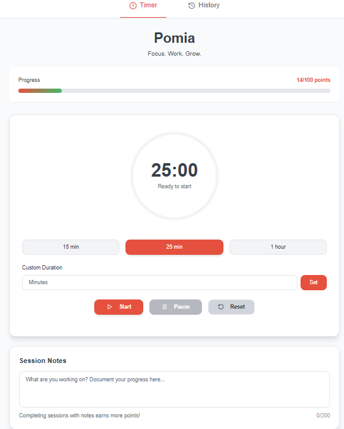
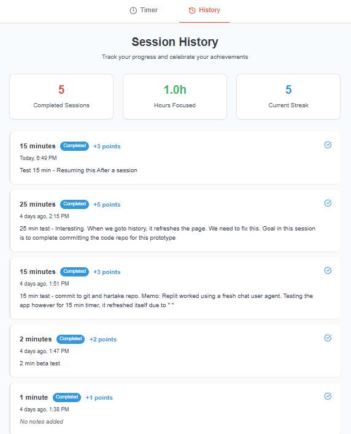

# Pomia - Pomodoro Timer App

A modern, gamified Pomodoro timer web application that helps users manage focused work sessions with progress tracking and motivation through points and achievements.


## 📸 Preview

Two previews:

1) Timer - Main timer interface with circular progress indicator and session controls*
2) History Session - showing completed Pomodoro sessions with points and statistics*


### Key Features in Action

| Feature | Screenshot |
|---------|------------|
| Pomia Timer Display |  |
| Pomia Session History Notes |  |

## ✨ Features

### 🎯 Core Timer Functionality
- **Customizable Durations**: Quick presets (15min, 25min, 1hr) plus custom timer settings
- **Pause & Resume**: Full control over your work sessions
- **Audio Notifications**: Sound alerts when sessions complete using Web Audio API
- **Visual Progress**: Beautiful circular progress indicator with real-time countdown

### 🎮 Gamification System
- **Point Rewards**: Earn 2-25 points based on session duration
- **Memo Bonus**: Full points for sessions with notes, 60% for sessions without
- **Progress Tracking**: Visual progress bar showing points earned out of 100
- **Achievement Statistics**: Track completed sessions, total hours, and current streak

### 📊 Session Management
- **Session History**: Detailed view of all past Pomodoro sessions
- **Progress Notes**: Add memos to document what you accomplished
- **Statistics Dashboard**: Overview of productivity metrics and achievements
- **Offline Support**: All data persisted locally using browser storage

### 🎨 User Experience
- **Clean Interface**: Inspired by Forest app and Be Focused Pro
- **Responsive Design**: Works seamlessly on desktop and mobile devices
- **Custom Color Scheme**: Tomato red primary, forest green secondary, clean whites
- **Intuitive Navigation**: Simple tab-based navigation between Timer and History

## 🛠 Tech Stack

### Frontend
- **React 18** with TypeScript for component-based UI
- **Tailwind CSS** for utility-first styling
- **shadcn/ui** components built on Radix UI primitives
- **Wouter** for lightweight client-side routing
- **TanStack Query** for server state management (future API integration)
- **Web Audio API** for notification sounds

### Backend
- **Node.js** with Express.js framework
- **TypeScript** with ES modules for type safety
- **Drizzle ORM** configured for PostgreSQL (ready for database migration)
- **Vite** development server with HMR

### Storage
- **Current**: Browser localStorage for offline-first experience
- **Future**: PostgreSQL with Neon serverless for cross-device sync

### Development Tools
- **Vite** for fast development and optimized builds
- **tsx** for TypeScript execution in development
- **ESBuild** for production bundling
- **Drizzle Kit** for database schema management

## 🏗 System Architecture

```
┌─────────────────────────────────────────┐
│               BROWSER                   │
│  ┌─────────────────────────────────┐   │
│  │         React Frontend          │   │
│  │  - Timer Logic & State          │   │
│  │  - UI Components               │   │
│  │  - Audio Notifications         │   │
│  └─────────────────────────────────┘   │
│                  │                      │
│  ┌─────────────────────────────────┐   │
│  │        LocalStorage             │   │
│  │  - Session History              │   │
│  │  - User Progress                │   │
│  │  - Timer State                  │   │
│  └─────────────────────────────────┘   │
└─────────────────────────────────────────┘
                  │
                  │ (Static files only)
                  │
┌─────────────────────────────────────────┐
│           EXPRESS SERVER                │
│  ┌─────────────────────────────────┐   │
│  │        Static File Server       │   │
│  │  - Serves HTML, CSS, JS         │   │
│  │  - Ready for API endpoints      │   │
│  └─────────────────────────────────┘   │
└─────────────────────────────────────────┘
```

## 🚀 Local Setup Instructions

### Prerequisites
- **Node.js** (version 18 or higher)
- **npm** or **yarn** package manager
- **Git** for version control

### Windows Setup

1. **Install Node.js**
   ```powershell
   # Download from https://nodejs.org/
   # Or using Chocolatey:
   choco install nodejs
   ```

2. **Clone the Repository**
   ```powershell
   git clone https://github.com/hartake/pomia.git
   cd pomia
   ```

3. **Install Dependencies**
   ```powershell
   npm install
   ```

4. **Start Development Server**
   ```powershell
   npm run dev
   ```

5. **Open in Browser**
   - Navigate to `http://localhost:5000`
   - The app will automatically reload when you make changes

### macOS Setup

1. **Install Node.js**
   ```bash
   # Download from https://nodejs.org/
   # Or using Homebrew:
   brew install node
   ```

2. **Clone the Repository**
   ```bash
   git clone https://github.com/hartake/pomia.git
   cd pomia
   ```

3. **Install Dependencies**
   ```bash
   npm install
   ```

4. **Start Development Server**
   ```bash
   npm run dev
   ```

5. **Open in Browser**
   - Navigate to `http://localhost:5000`
   - The app will automatically reload when you make changes

### Linux Setup

1. **Install Node.js**
   ```bash
   # Using package manager (Ubuntu/Debian):
   curl -fsSL https://deb.nodesource.com/setup_18.x | sudo -E bash -
   sudo apt-get install -y nodejs
   
   # Or using snap:
   sudo snap install node --classic
   ```

2. **Clone and Setup** (same as macOS)
   ```bash
   git clone https://github.com/hartake/pomia.git
   cd pomia
   npm install
   npm run dev
   ```

## 📁 Project Structure

```
pomia/
├── client/                 # Frontend React application
│   ├── src/
│   │   ├── components/     # Reusable UI components
│   │   │   ├── ui/         # shadcn/ui components
│   │   │   ├── navigation.tsx
│   │   │   ├── timer-display.tsx
│   │   │   ├── progress-bar.tsx
│   │   │   └── session-history.tsx
│   │   ├── hooks/          # Custom React hooks
│   │   │   ├── use-timer.tsx
│   │   │   ├── use-audio.tsx
│   │   │   └── use-local-storage.tsx
│   │   ├── pages/          # Page components
│   │   │   ├── timer.tsx
│   │   │   └── history.tsx
│   │   ├── lib/            # Utilities and configuration
│   │   └── App.tsx         # Main application component
│   └── index.html          # HTML entry point
├── server/                 # Backend Express application
│   ├── index.ts            # Server entry point
│   ├── routes.ts           # API routes (ready for future use)
│   ├── storage.ts          # Data storage interface
│   └── vite.ts             # Vite development server setup
├── shared/                 # Shared TypeScript definitions
│   └── schema.ts           # Database schema and types
├── package.json            # Dependencies and scripts
├── vite.config.ts          # Vite configuration
├── tailwind.config.ts      # Tailwind CSS configuration
└── README.md               # This file
```

## 🎮 How to Use

### Starting a Pomodoro Session

1. **Choose Duration**: Select from preset options (15min, 25min, 1hr) or set a custom time
2. **Add Notes** (Optional): Write what you plan to work on in the session notes field
3. **Start Timer**: Click the Start button to begin your focused work session
4. **Stay Focused**: Work until the timer completes and plays a notification sound
5. **Earn Points**: Receive points based on session duration and whether you added notes

### Tracking Progress

- **View History**: Switch to the History tab to see all completed sessions
- **Check Statistics**: Monitor your total sessions, hours focused, and current streak
- **Progress Bar**: Watch your points accumulate toward the 100-point milestone

### Point System

- **Base Points**: 2-25 points based on session duration (longer sessions = more points)
- **Memo Bonus**: Full points for sessions with notes, 60% points without notes
- **Calculation**: `Math.min(Math.max(Math.floor(duration_minutes / 5), 2), 25)`

## 🔧 Available Scripts

```bash
# Start development server (frontend + backend)
npm run dev

# Build for production
npm run build

# Preview production build
npm run preview

# Run type checking
npm run type-check

# Generate database migrations (when using PostgreSQL)
npx drizzle-kit generate
npx drizzle-kit migrate
```

## 🌟 Future Enhancements

### Planned Features
- **User Authentication**: Account system for cross-device synchronization
- **Database Integration**: PostgreSQL backend for persistent data storage
- **Real-time Statistics**: Live updates and sharing capabilities
- **Mobile App**: Native iOS and Android applications
- **Advanced Analytics**: Detailed productivity insights and reports
- **Team Features**: Shared goals and collaborative Pomodoro sessions

### Technical Improvements
- **PWA Support**: Offline functionality and app-like experience
- **WebSocket Integration**: Real-time notifications and updates
- **API Endpoints**: RESTful API for data management
- **Caching Strategy**: Redis integration for improved performance
- **CI/CD Pipeline**: Automated testing and deployment

## 🤝 Contributing

1. Fork the repository
2. Create a feature branch (`git checkout -b feature/amazing-feature`)
3. Commit your changes (`git commit -m 'Add amazing feature'`)
4. Push to the branch (`git push origin feature/amazing-feature`)
5. Open a Pull Request

## 📄 License

This project is licensed under the MIT License - see the [LICENSE](LICENSE) file for details.

## 🙏 Acknowledgments

- Inspired by the Pomodoro Technique developed by Francesco Cirillo
- UI design influenced by Forest app and Be Focused Pro
- Built with modern web technologies and best practices
- Special thanks to the open-source community for the amazing tools and libraries

---

**Happy focusing! 🍅⏱️**

> "The secret of getting ahead is getting started." - Mark Twain